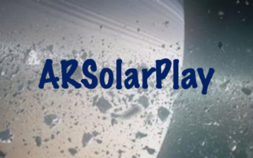
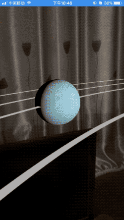

## ARSolarPlay

- This project is used to demonstrate the motion of the solar system, we can observe each planet or solar system from any angle and the details of the trajectory.
- We use ARKit technology to achieve it, I'm surprised at its effect.

## Requirements

- iOS 11.0+
- Xcode 9.0+
- iPhone 6s+

## Related articles

- http://www.jianshu.com/p/82d7496263c7
- http://www.jianshu.com/p/d0721aabcbf7

## Related Video & Gif

- 

- https://www.bilibili.com/video/av12175891/

## Author

miliPolo, 823165768@qq.com

 

